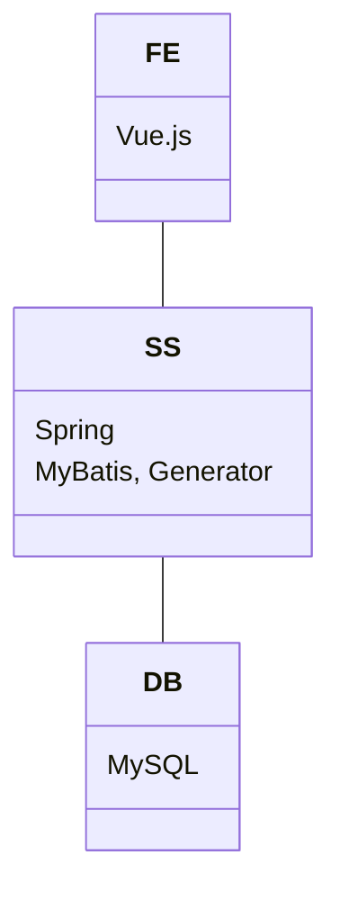

# sample

技術メモ用のサンプルプロジェクトです。Spring Boot, MyBatis(Generator)を使っています。

## 学級管理システム

学級、生徒、成績などを管理するシステムです。

## ディレクトリ構成

```text
sample
├ docker-compose.yaml
├ src SSのプログラムのディレクトリ
├ env コンテナの環境変数を設定するファイルのディレクトリ
├ vue Vue.jsのプログラムのディレクトリ
├ mysql MySQLのコンテナ用のディレクトリ。初期実行のSQLやdataが格納される。
├ doc 仕様書のディレクトリ
└ README.md このファイル
```

## システム構成

docker-compose.ymlで構成する。



### SS

REST API風とする。DBアクセスはMyBatisを用いて、エンティティやマッパーはMyBatis Generatorを用いる。

### FE

Vue.jsでSSからのレスポンスを表示する。

- Add TypeScript
- Add Vue Router for Single Page Application development
- Add Vitest for Unit Testing

をYesにした。

### DB

MySQLで作成する。

## 今後のメモ

- FEはThymeleafを用いたものも作りたい。システムを分けるのもなんなので、一部ユーザーしか使わないみたいな、教員が使うものではなくシステム管理用みたいなのだけを実装したい。
