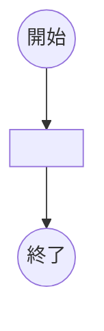

# API共通

- [API共通](#api共通)
  - [ヘルスチェックAPI](#ヘルスチェックapi)
  - [エラー](#エラー)

## ヘルスチェックAPI

OKという文字をレスポンスボディにセットして返す。

以下はテンプレ用。

| メソッド | エンドポイント |
| -------- | -------------- |
| GET      | -              |

リクエスト

| 論理名 | 物理名 | 型  | 必須 | 桁  | 補足 |
| ------ | ------ | --- | ---- | --- | ---- |
| -      |        |     |      |     |      |

レスポンス

| 論理名     | 物理名      | 型           | 必須 | 桁  | 補足 |
| ---------- | ----------- | ------------ | ---- | --- | ---- |
| 生徒リスト | studentList | List(Object) |      |     |      |
| - 生徒番号 | studentId   | integer      | ◯    |     |      |
| - 苗字     | familyName  | string       | ◯    |     |      |
| - 名前     | firstName   | string       | ◯    |     |      |

レスポンスサンプル

```json
{
  "studentLists":[
    {
        "studentId": 1,
        "familyName": "佐藤",
        "firstName": "太郎"
    }
  ]
}
```

処理フロー



## エラー
