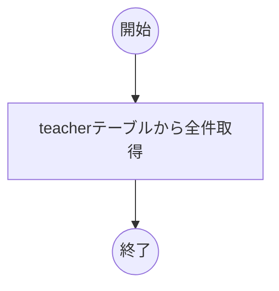
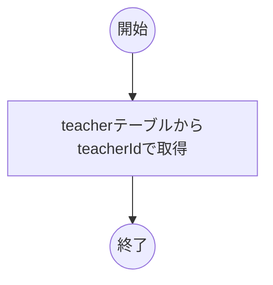
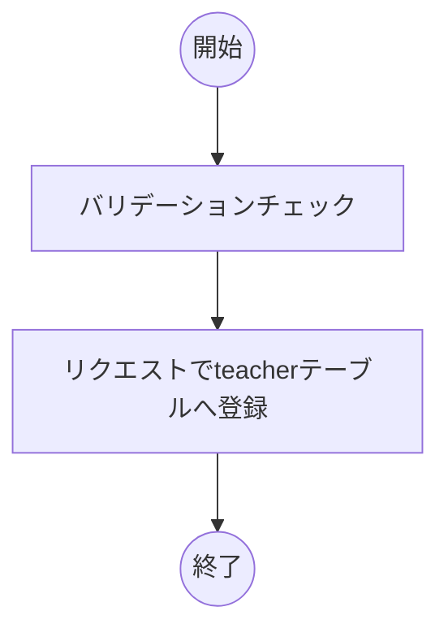
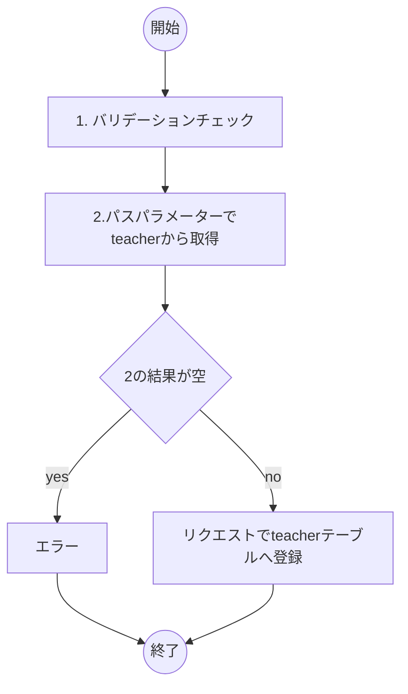
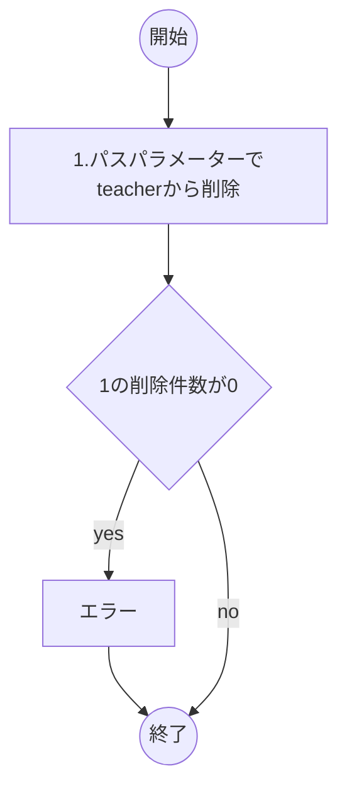

# 先生情報API

| 共通エンドポイント |
| ------------------ |
| `/api/teacher`     |

- [先生情報API](#先生情報api)
  - [一覧取得](#一覧取得)
  - [1件取得](#1件取得)
  - [登録](#登録)
  - [更新](#更新)
  - [削除](#削除)

## 一覧取得

| メソッド | エンドポイント |
| -------- | -------------- |
| GET      | -              |

リクエスト

| 論理名 | 物理名 | 型  | 必須 | 桁  | 補足 |
| ------ | ------ | --- | ---- | --- | ---- |
| -      |        |     |      |     |      |

レスポンス

| 論理名     | 物理名      | 型           | 必須 | 桁  | 補足 |
| ---------- | ----------- | ------------ | ---- | --- | ---- |
| 先生リスト | teacherList | List(Object) |      |     |      |
| - 先生番号 | teacherId   | integer      | ◯    |     |      |
| - 苗字     | familyName  | string       | ◯    |     |      |
| - 名前     | firstName   | string       | ◯    |     |      |

レスポンスサンプル

```json
{
  "teacherLists":[
    {
        "teacherId": 1,
        "familyName": "佐藤",
        "firstName": "太郎"
    }
  ]
}
```

処理フロー



## 1件取得

| メソッド | エンドポイント |
| -------- | -------------- |
| GET      | `/{teacherId}` |

パスパラメーター

| 論理名   | 物理名    | 型      | 必須 | 桁  | 補足 |
| -------- | --------- | ------- | ---- | --- | ---- |
| 先生番号 | teacherId | integer | ◯    |     |      |

リクエスト

| 論理名 | 物理名 | 型  | 必須 | 桁  | 補足 |
| ------ | ------ | --- | ---- | --- | ---- |
| -      |        |     |      |     |      |

レスポンス

| 論理名   | 物理名     | 型      | 必須 | 桁  | 補足 |
| -------- | ---------- | ------- | ---- | --- | ---- |
| 先生番号 | teacherId  | integer | ◯    |     |      |
| 苗字     | familyName | string  | ◯    |     |      |
| 名前     | firstName  | string  | ◯    |     |      |

レスポンスサンプル

```json
{
  "teacherId": 1,
  "familyName": "佐藤",
  "firstName": "太郎"
}
```

処理フロー



## 登録

| メソッド | エンドポイント |
| -------- | -------------- |
| POST     | -              |

リクエスト

| 論理名 | 物理名     | 型     | 必須 | 桁  | 補足 |
| ------ | ---------- | ------ | ---- | --- | ---- |
| 苗字   | familyName | string | ◯    |     |      |
| 名前   | firstName  | string | ◯    |     |      |

リクエストサンプル

```json
{
  "familyName": "佐藤",
  "firstName": "太郎"
}
```

レスポンス

| 論理名   | 物理名     | 型      | 必須 | 桁  | 補足 |
| -------- | ---------- | ------- | ---- | --- | ---- |
| 先生番号 | teacherId  | integer | ◯    |     |      |
| 苗字     | familyName | string  | ◯    |     |      |
| 名前     | firstName  | string  | ◯    |     |      |

レスポンスサンプル

```json
{
  "teacherId": 1,
  "familyName": "佐藤",
  "firstName": "太郎"
}
```

処理フロー



## 更新

| メソッド | エンドポイント |
| -------- | -------------- |
| PUT      | `/{teacherId}` |

パスパラメーター

| 論理名   | 物理名    | 型      | 必須 | 桁  | 補足 |
| -------- | --------- | ------- | ---- | --- | ---- |
| 先生番号 | teacherId | integer | ◯    |     |      |

リクエスト

| 論理名 | 物理名     | 型     | 必須 | 桁  | 補足 |
| ------ | ---------- | ------ | ---- | --- | ---- |
| 苗字   | familyName | string | ◯    |     |      |
| 名前   | firstName  | string | ◯    |     |      |

レスポンス

| 論理名 | 物理名 | 型  | 必須 | 桁  | 補足 |
| ------ | ------ | --- | ---- | --- | ---- |
| -      |        |     |      |     |      |

処理フロー



## 削除

| メソッド | エンドポイント |
| -------- | -------------- |
| DELETE   | `/{teacherId}` |

パスパラメーター

| 論理名   | 物理名    | 型      | 必須 | 桁  | 補足 |
| -------- | --------- | ------- | ---- | --- | ---- |
| 先生番号 | teacherId | integer | ◯    |     |      |

リクエスト

| 論理名 | 物理名 | 型  | 必須 | 桁  | 補足 |
| ------ | ------ | --- | ---- | --- | ---- |
| -      |        |     |      |     |      |

レスポンス

| 論理名 | 物理名 | 型  | 必須 | 桁  | 補足 |
| ------ | ------ | --- | ---- | --- | ---- |
| -      |        |     |      |     |      |

処理フロー


